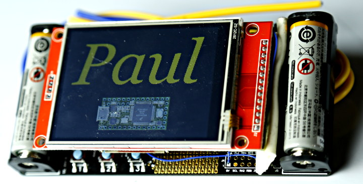
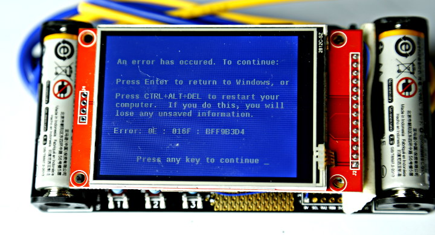
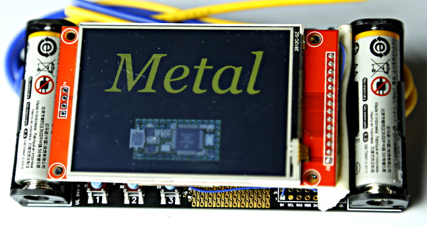

# Paul's Hackaday Supercon 2017 Badge "Hack"

In the last hour before heading to the airport to travel to Supercon 2017,
I put a Teensy 3.2 on the back of a 2.8 inch TFT and programmed it to print
my name and a photo of the Teensy.

The original badge was used only for 3V power.  This display was attached
with double-sticky mounting tape.

At the Friday evening pre-party, Metalnat Hayes suggested it should have a
Blue Screen of Death.  I added one in the hotel Saturday morning, activated
by touching the screen.

I also put in a little Easter Egg to print Metal's name.  Since I was only
staying for half of Saturday, I handed the badge off to him to use for the
rest of the convention.

Thanks to Metal & Roger Lou for taking these photos.
